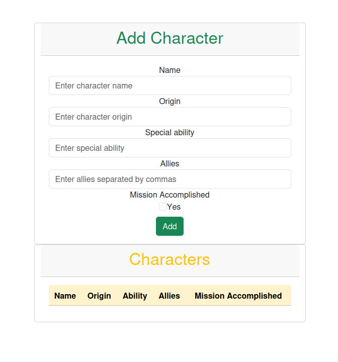
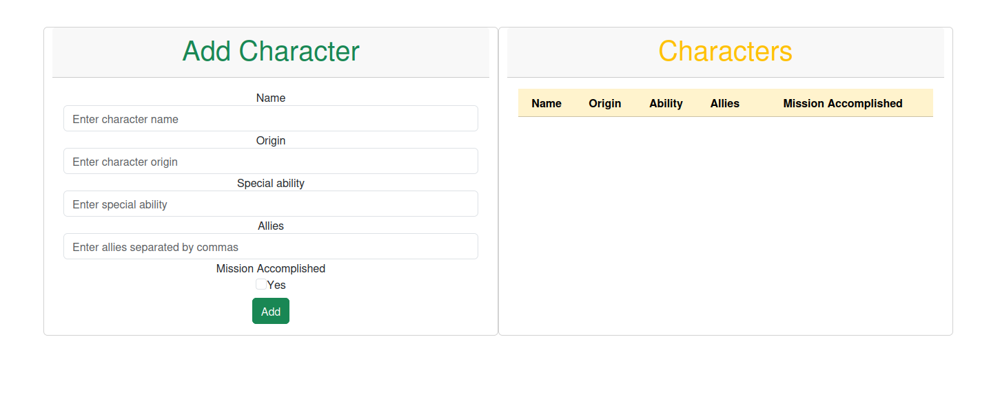
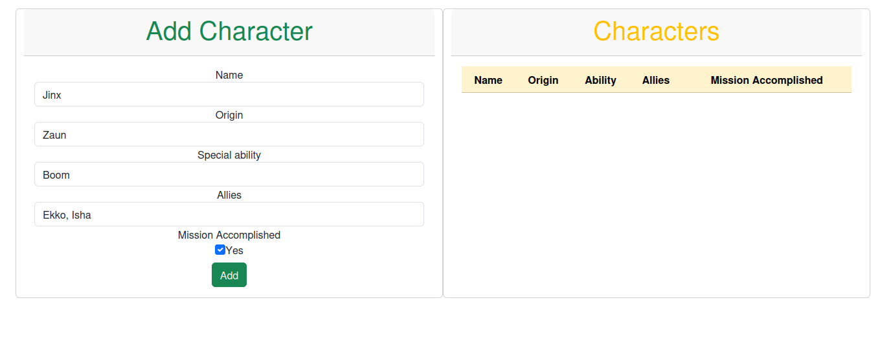
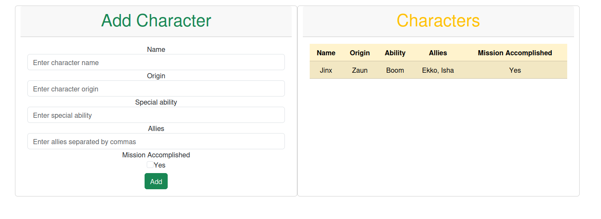

<div align="justify">

# Mi Aplicación Vue (Arcane Edition)

## Índice

- [Creación de proyecto](#index01)
- [Planteamiento de ejercicio](#index02)
- [Estructura del proyecto](#index03)
- [Componente CharacterData](#index04)
- [Comprobación de funcionamiento](#index05)

### Creación de proyecto <a name="index01"></a>


### Planteamiento de ejercicio <a name="index02"></a>

Instrucciones:

    Diseña y desarrolla una aplicación en VueJS con un componente único que cumpla con las siguientes funcionalidades:
        Formulario para añadir personajes de Arcane:
            Permite registrar un personaje ingresando:
                Nombre (Ejemplo: "Jinx", "Vi")
                Origen (Ejemplo: "Píltover", "Zaun")
                Habilidad especial (Ejemplo: "Manipulación de explosivos", "Combate cuerpo a cuerpo")
                Lista de aliados (Ejemplo: "Ekko", "Caitlyn")
                Checkbox que indique si el personaje ha cumplido su misión principal.
        Tabla de visualización de personajess registrados:
            Muestra todos los personajes registrados en el sistema, incluyendo todos los datos ingresados desde el formulario.

    Requisitos:
        Realiza toda la gestión de datos de manera volátil, es decir, sin conexión con APIs ni bases de datos. Los datos se gestionarán directamente en el estado del componente.
        Usa un único componente para combinar las funcionalidades del formulario y la tabla.
        Haz uso de las directivas necesarias que hemos visto en clase para gestionar la interacción y el comportamiento de los elementos del componente.
        Consulta la documentación disponible en el campus como referencia para la implementación.
        Utiliza Bootstrap para proporcionar un diseño visual más atractivo y estructurado a la aplicación.
        La aplicación deberá ser desarrollada utilizando una de las dos formas vistas en clase: Composition API o Option API.

    Simplificaciones para esta versión del ejercicio:
        No se requiere separar las funcionalidades en componentes adicionales, todo debe implementarse dentro de un único componente.
        El sistema no requiere persistencia de datos ni funcionalidades avanzadas, solo debe manejar los datos de manera local dentro del componente.

### Estructura del proyecto <a name="index03"></a>


La estructura de carpetas es bastante sencilla, puesto que el ejercicio requiere de un componente único sin modelo ni nada por el estilo.

### Componente CharacterData <a name="index04"></a>

Template:

```html
    <div class="container">
        <div class="row">
            <div class="card col-12 col-lg-6">
                <div class="card-header">
                    <h1 class="text-success">Add Character</h1>
                </div>
                <div class="card-body">
                    <form @submit.prevent="addCharacter">
                        <div class="form-group">
                            <label for="name">Name</label>
                            <input type="text" class="form-control" id="name" v-model="name" placeholder="Enter character name"/>
                        </div>
                        <div class="form-group">
                            <label for="origin">Origin</label>
                            <input type="text" class="form-control" id="origin" v-model="origin" placeholder="Enter character origin"/>
                        </div>
                        <div class="form-group">
                            <label for="ability">Special ability</label>
                            <input type="text" class="form-control" id="ability" v-model="ability" placeholder="Enter special ability"/>
                        </div>
                        <div class="form-group">
                            <label for="allies">Allies</label>
                            <input type="text" class="form-control" id="allies" v-model="allies" placeholder="Enter allies separated by commas"/>
                        </div>
                        <div class="form-group">
                            <div>
                                <label for="mission">Mission Accomplished</label>
                            </div>

                            <input type="checkbox" class="form-check-input" id="mission" v-model="mission"/>
                            <label class="form-check-label" for="mission">Yes</label>
                        </div>

                        <button type="submit" class="btn btn-success mt-2">Add</button>
                    </form>
                </div>
            </div>

            <div class="card col-12 col-lg-6">
                <div class="card-header">
                    <h1 class="text-warning">Characters</h1>
                </div>

                <div class="card-body">
                    <table class="table table-striped table-warning">
                        <thead>
                            <tr>
                                <th>Name</th>
                                <th>Origin</th>
                                <th>Ability</th>
                                <th>Allies</th>
                                <th>Mission Accomplished</th>
                            </tr>
                        </thead>
                        <tbody>
                            <tr v-for="charac in characters" :key="charac.name">
                                <td>{{ charac.name }}</td>
                                <td>{{ charac.origin }}</td>
                                <td>{{ charac.ability }}</td>
                                <td>{{ charac.allies.join(', ') }}</td>
                                <td>{{ charac.mission ? 'Yes' : 'No' }}</td>
                            </tr>
                        </tbody>
                    </table>
                </div>
            </div>
        </div>
    </div>
```

#### Directivas implementadas

- [v-model](https://vuejs.org/api/built-in-directives.html#v-model): Utilizado en este caso para enlazar los datos de los inputs del formulario con las propiedades del componente en el script, el cual se mostrará posteriormente.
    - Ejemplo template:
        ```html
            <input type="text" class="form-control" id="name" v-model="name" placeholder="Enter character name"/>
        ```
    - Ejemplo script:
        ```js
            const name = ref('');
        ```

- [v-for](https://vuejs.org/api/built-in-directives.html#v-for): La directiva v-for recorre una colección que esté entre las propiedades del componente y se puede utilizar para mostrar un listado de elementos, en este caso los personajes registrados en la tabla.
    - Ejemplo template:
        ```html
            <tr v-for="charac in characters" :key="charac.name">
                <td>{{ charac.name }}</td>
                <td>{{ charac.origin }}</td>
                <td>{{ charac.ability }}</td>
                <td>{{ charac.allies.join(', ') }}</td>
                <td>{{ charac.mission ? 'Yes' : 'No' }}</td>
            </tr>
        ```
    - Ejemplo script:
        ```js
            const characters = ref([]);
        ```

Script:

```js
<script setup>
import { ref } from 'vue';

    
    const characters = ref([]);

    const name = ref('');
    const origin = ref('');
    const ability = ref('');
    const allies = ref([]);
    const mission = ref(false);

    const addCharacter = () => {
        const newCharacter = {
            name: name.value,
            origin: origin.value,
            ability: ability.value,
            allies: allies.value.split(',').map(ally => ally.trim()),
            mission: mission.value
        };

        characters.value.push(newCharacter);

        resetForm();
    }

    const resetForm = () => {
        name.value = '';
        origin.value = '';
        ability.value = '';
        allies.value = [];
        mission.value = false;
    }

</script>
```

La parte del script es sencilla, simplemente declaramos las propiedades y tenemos una función para agregar personaje a la lista (la cual se leerá automáticamente gracias a la directiva v-for) y otra para dejar el formulario como estaba antes.

No hay CSS propio en la parte de style, pero se usa Bootstrap para proporcionar un diseño visual más atractivo y estructurado a la app, además de implementar responsividad de manera más fácil. El CDN de Bootstrap está en el index.html en la carpeta public.

- Dispositivos móviles/tablets:
    
- Ordenadores:
    

### Comprobación de funcionamiento <a name="index05"></a>




</div>
