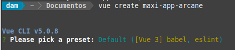
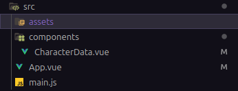

<div align="justify">

# Mi Aplicación Vue (Arcane Edition)

## Índice

- [Creación de proyecto](#index01)
- [Planteamiento de ejercicio](#index02)
- [Estructura del proyecto](#index03)
- [Componente CharacterData](#index04)
- [Directivas implementadas](#index05)
- [Comprobación de funcionamiento](#index06)

### Creación de proyecto <a name="index01"></a>



### Planteamiento de ejercicio <a name="index02"></a>

Instrucciones:

    Diseña y desarrolla una aplicación en VueJS con un componente único que cumpla con las siguientes funcionalidades:
        Formulario para añadir personajes de Arcane:
            Permite registrar un personaje ingresando:
                Nombre (Ejemplo: "Jinx", "Vi")
                Origen (Ejemplo: "Píltover", "Zaun")
                Habilidad especial (Ejemplo: "Manipulación de explosivos", "Combate cuerpo a cuerpo")
                Lista de aliados (Ejemplo: "Ekko", "Caitlyn")
                Checkbox que indique si el personaje ha cumplido su misión principal.
        Tabla de visualización de personajess registrados:
            Muestra todos los personajes registrados en el sistema, incluyendo todos los datos ingresados desde el formulario.

    Requisitos:
        Realiza toda la gestión de datos de manera volátil, es decir, sin conexión con APIs ni bases de datos. Los datos se gestionarán directamente en el estado del componente.
        Usa un único componente para combinar las funcionalidades del formulario y la tabla.
        Haz uso de las directivas necesarias que hemos visto en clase para gestionar la interacción y el comportamiento de los elementos del componente.
        Consulta la documentación disponible en el campus como referencia para la implementación.
        Utiliza Bootstrap para proporcionar un diseño visual más atractivo y estructurado a la aplicación.
        La aplicación deberá ser desarrollada utilizando una de las dos formas vistas en clase: Composition API o Option API.

    Simplificaciones para esta versión del ejercicio:
        No se requiere separar las funcionalidades en componentes adicionales, todo debe implementarse dentro de un único componente.
        El sistema no requiere persistencia de datos ni funcionalidades avanzadas, solo debe manejar los datos de manera local dentro del componente.

### Estructura del proyecto <a name="index03"></a>



La estructura de carpetas es bastante sencilla, puesto que el ejercicio requiere de un componente único sin modelo ni nada por el estilo.

### Componente CharacterData <a name="index04"></a>

Template:

```html
    
```

</div>
